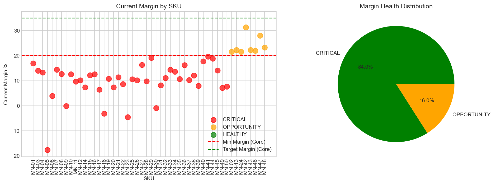
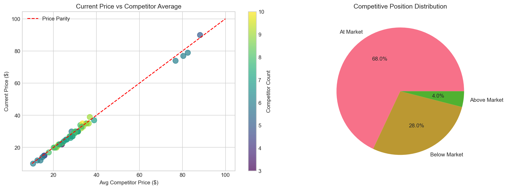
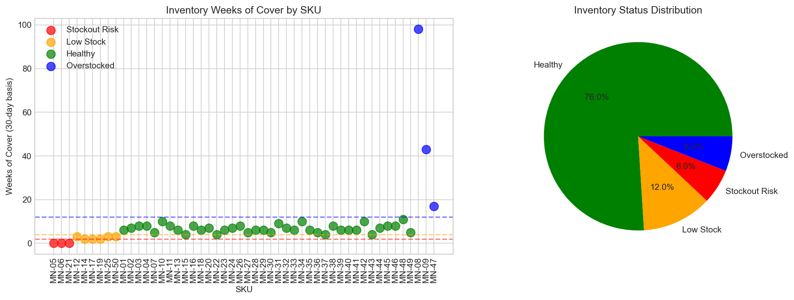
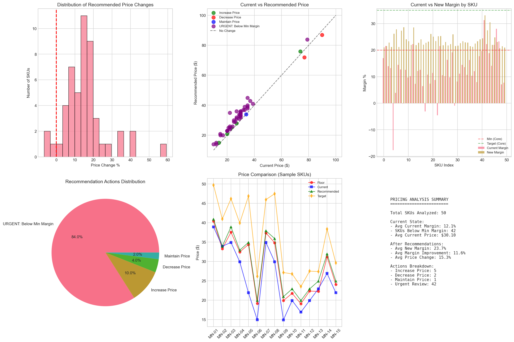

# 💰 Pricing Strategy Optimization Framework

**Enterprise-Grade Pricing Analysis & Optimization Solution**

A comprehensive, data-driven pricing optimization framework designed to analyze product pricing, competitor positioning, margin health, and inventory dynamics to generate actionable, profit-maximizing pricing recommendations.

**Key Capabilities:**
- Automated pricing analysis across product catalogs
- Multi-factor pricing optimization (margin, competition, inventory, velocity)
- Competitor price intelligence and positioning analysis
- Advanced margin health diagnostics and improvement forecasting
- Interactive Jupyter-based analysis notebook
- Production-ready visualization dashboards
- Scalable Python framework for enterprise deployment

---

## 📊 Data Flow Architecture

```
┌────────────────────────────────────────────────────────────┐
│       PRICING OPTIMIZATION PIPELINE FLOW                   │
└────────────────────────────────────────────────────────────┘

SOURCE DATA → EXTRACT → TRANSFORM → ANALYZE → FRAMEWORK → RECOMMEND → OUTPUT
```

---

## 📈 Analysis Dashboards & Visualizations

### Margin Health Analysis


### Competitive Position Analysis  


### Inventory Health Assessment


### Pricing Strategy Summary


---

## 🎯 Key Features

### 1. **Multi-Factor Pricing Analysis**
- Margin analysis and health classification
- Competitive pricing intelligence
- Cost decomposition and analysis
- Market positioning assessment

### 2. **Advanced Optimization Engine**
- Floor price calculation for minimum margins
- Target price setting for profitability
- Intelligent adjustment factors based on inventory, velocity, returns, ads

### 3. **Smart Inventory Correlation**
- Automatic price adjustments based on stock levels
- 90-day inventory projections
- Stockout risk detection

### 4. **Sales Velocity Intelligence**
- 90-day sales trend analysis
- Product momentum classification
- Conversion rate tracking

### 5. **Ad & Returns Performance Analysis**
- ACOS/ROAS optimization
- Return rate assessments
- Ad efficiency classification

### 6. **Interactive Jupyter Notebook**
- Full reproducible analysis pipeline
- Custom visualizations

---

## 🛠️ Tech Stack

| Component | Technology |
|-----------|-----------|
| Analysis Engine | Python 3.x |
| Data Processing | Pandas, NumPy |
| Visualization | Matplotlib, Seaborn |
| Notebooks | Jupyter |
| Testing | pytest |
| Version Control | Git/GitHub |

---

## 📦 Dependencies

```
pandas>=1.3.0
numpy>=1.21.0
matplotlib>=3.4.0
seaborn>=0.11.0
jupyter>=1.0.0
pytest>=6.2.0
```

---

## 📋 Project Structure

```
pricing-strategy-optimization-framework/
├── src/
│   ├── __init__.py
│   ├── pricing_analyzer.py
│   ├── config.py
│   └── validators.py
├── notebooks/
│   └── pricing_analysis.ipynb
├── data/
│   ├── master_pricing_analysis.csv
│   ├── pricing_recommendations.csv
│   └── executive_summary.txt
├── visualizations/
│   ├── margin_analysis.png
│   ├── competitive_analysis.png
│   ├── inventory_analysis.png
│   └── pricing_summary.png
├── tests/
│   └── test_analyzer.py
├── requirements.txt
├── .gitignore
└── README.md
```

---

## 🚀 Getting Started

### Prerequisites
- Python 3.8+
- pip
- Git
- Virtual environment

### Installation

```bash
# Clone repository
git clone https://github.com/PushpaPujar/pricing-strategy-optimization-framework.git
cd pricing-strategy-optimization-framework

# Create virtual environment
python -m venv venv
venv\Scripts\activate  # Windows

# Install dependencies
pip install -r requirements.txt
```

---

## 📊 Usage Guide

### Option 1: Jupyter Notebook
```bash
cd notebooks
jupyter notebook
# Open pricing_analysis.ipynb
```

### Option 2: Python API
```python
from src.pricing_analyzer import PricingAnalyzer
analyzer = PricingAnalyzer()
recommendations = analyzer.generate_recommendations()
```

### Option 3: Run Tests
```bash
pytest tests/ -v
```

---

## 🔄 Pricing Analysis Workflow

1. **Extract**: Load 6 CSV data sources
2. **Transform**: Clean and standardize data
3. **Analyze**: Calculate margins, competition, inventory, sales
4. **Framework**: Apply pricing logic and adjustments
5. **Recommend**: Generate final prices and actions
6. **Report**: Create visualizations and exports

---

## 📈 Key Outputs

### 1. Pricing Recommendations CSV
SKU-level recommendations with price changes and actions

### 2. Master Analysis Dataset
Complete analysis including all pricing tiers and metrics

### 3. Executive Summary
Strategic overview and implementation roadmap

### 4. Visualizations
4 production-ready dashboards in PNG format

---

## 🎲 Configuration

Edit `src/config.py` to customize:

```python
MIN_ACCEPTABLE_MARGIN = 20.0
TARGET_GROSS_MARGIN = 35.0
MAX_PRICE_INCREASE = 0.30
MAX_PRICE_DECREASE = 0.10
```

---

## 🔍 Data Requirements

**Pricing_Data.csv**: SKU, Product, Cost, Current Price, Fees

**Competitor_Data.csv**: SKU, Competitor Prices

**Inventory_Health.csv**: SKU, Stock Levels, Weeks of Cover

**Historical_Sales.csv**: Date, SKU, Units, Sales

**Ads_Performance.csv**: Spend, Impressions, ACOS, ROAS

**Returns_Data.csv**: SKU, Return Quantities

---

## 📊 Recommendation Types

- **URGENT**: Below minimum margin
- **HIGH**: Price increase opportunity
- **MEDIUM**: Price decrease
- **LOW**: Maintain price

---

## 🔧 Troubleshooting

| Issue | Solution |
|-------|----------|
| ModuleNotFoundError | `pip install -r requirements.txt` |
| Jupyter not found | `pip install jupyter` |
| CSV loading error | Check encoding (UTF-8) |
| Visualizations missing | Run in Jupyter notebook |

---

## 🔐 Best Practices

1. Validate source data before analysis
2. Maintain CSV backups
3. Test recommendations on sample
4. Monitor actual vs. forecasted results
5. Protect sensitive pricing data

---

## 📞 Support

- **Notebooks**: See `notebooks/` folder
- **Code Documentation**: Inline docstrings
- **Configuration**: Review `src/config.py`
- **Issues**: Report on GitHub

---

## 📜 License

MIT License - see [LICENSE.md](LICENSE.md)

---

## 👥 Contributors

- **Development**: Analytics & Pricing Strategy Team
- **Last Updated**: February 2026
- **Version**: 1.0.0

---

## 🎯 Roadmap

- [ ] Real-time competitor tracking
- [ ] Dynamic pricing ML models
- [ ] Automated price adjustment
- [ ] Multi-currency support
- [ ] Cloud deployment
- [ ] REST API
- [ ] Mobile dashboard

---

**For questions or improvements, open an issue on GitHub.**
